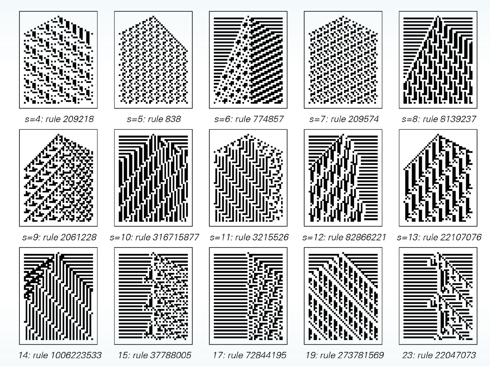

# Week 1 Report

## Team Members:

- Leif Huender
- Aaron Froese
- Shaun Swant

## Introduction

Our project is an adaptation of John Conway's Game of Life, aiming to explore the principles of cellular automata through interactive gameplay. The game is designed to allow for varied levels of user interaction, ranging from passive observation to active manipulation of the game environment.

### Project Background

Automata is being developed as a graphical user interface game that operates on the fundamental rules of cellular automata. In this grid-based game, each cell can exist in one of two states: alive or dead. The state of each cell at any given moment is determined by its previous state and the states of its adjacent neighbors. This simple rule set is capable of producing remarkably complex patterns and behaviors, some of which have been demonstrated to be Turing complete.

The game introduces three modes of play:

- **Zero Player Mode:** The game evolves automatically based on predefined initial conditions.
- **Human Player Mode:** Players can interact with the grid, modifying cell states to influence the evolution of the pattern.
- **AI Player Mode:** An artificial intelligence controls the evolution of the game, demonstrating the potential for complex strategy and pattern development.

### Visual Documentation

For a dynamic representation of cellular automata, we recommend viewing the video ["Life in Life"](https://www.youtube.com/watch?v=xP5-iIeKXE8), which showcases the evolution of patterns over time.

Included are screenshots demonstrating examples of cellular automata patterns. These visuals are instrumental in illustrating the potential complexity and aesthetic appeal of "Automata":

- 
- 

